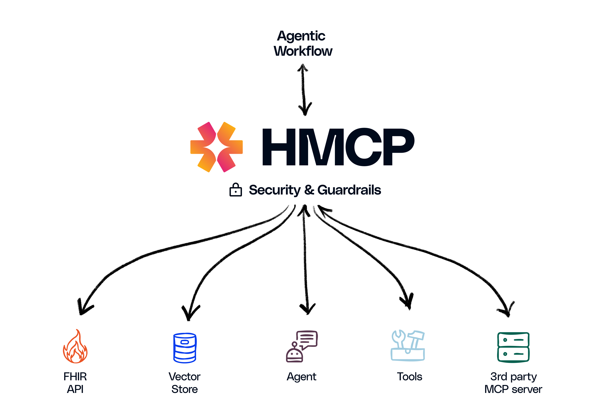

# Healthcare Model Context Protocol (HMCP)

**_An open protocol enabling communication and interoperability between healthcare agentic applications._**

Healthcare is rapidly embracing an AI-driven future. From ambient clinical documentation to decision support, generative AI agents hold immense promise to transform care delivery. However, as the industry swiftly moves to adopt AI-powered solutions, it faces a significant challenge: ensuring AI agents are secure, compliant, and seamlessly interoperable within real-world healthcare environments.

At Innovaccer, we are proud to launch the Healthcare Model Context Protocol (HMCP). HMCP is a specialized extension of the Model Context Protocol (MCP) specifically crafted to integrate healthcare AI agents with data, tools, and workflows, all within a secure, compliant, and standards-based framework.

## Overview & Motivation

### Overview
MCP Model Context Protocol was created by Anthropic to allow host agentic applications (like Claude Desktop App, Cursor) to communicate with other systems (like local files, API servers) to augment the LLM input with additional context 

#### Why Healthcare Needs HMCP

Healthcare demands precision and accountability. AI agents operating within this domain must handle sensitive patient data securely, adhere to rigorous compliance regulations, and maintain consistent interoperability across diverse clinical workflows. Standard, generalized protocols fall short. That is why we developed HMCP.

Built upon the robust foundation of MCP, HMCP introduces essential healthcare-specific capabilities:
- HIPAA-compliant security and access management
- Comprehensive logging and auditing of agent activities
- Separation and protection of patient identities
- Application of healthcare-specific operational guardrails
- Facilitation of secure, compliant collaboration between multiple AI agents

**_Think of HMCP as the "universal connector" for healthcare AI—a trusted, standardized way to ensure seamless interoperability._**

## Specification

[Specification](./docs/specification/index.md)

## HMCP SDK

[HMCP SDK](./src/hmcp/README.md)

## Examples

[Examples](./examples/README.md)

## Contributing

Please see [CONTRIBUTING.md](CONTRIBUTING.md) for details on how to contribute to this
project.

## License

This project is licensed under the MIT License—see the [LICENSE](LICENSE) file for
details.
