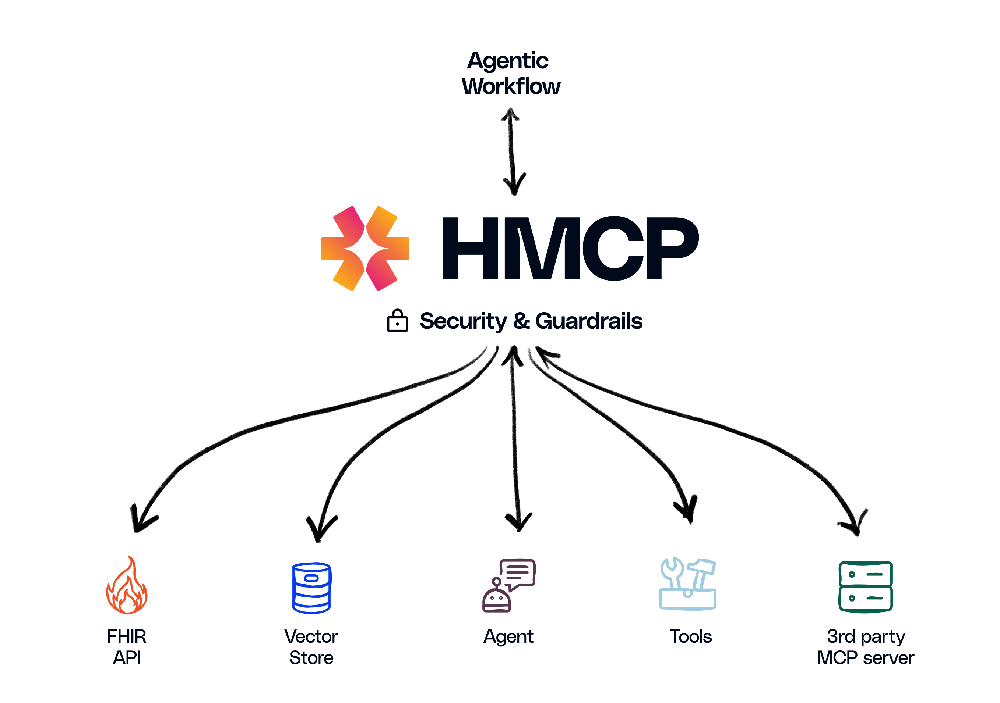

# Welcome to Healthcare-MCP Docs


# Healthcare Model Context Protocol (HMCP)

**_An open protocol enabling communication and interoperability between healthcare agentic applications._**

Healthcare is rapidly embracing an AI-driven future. From ambient clinical documentation to decision support, generative AI agents hold immense promise to transform care delivery. However, as the industry swiftly moves to adopt AI-powered solutions, it faces a significant challenge: ensuring AI agents are secure, compliant, and seamlessly interoperable within real-world healthcare environments.

At Innovaccer, we are proud to launch the Healthcare Model Context Protocol (HMCP). HMCP is a specialized extension of the Model Context Protocol (MCP) specifically crafted to integrate healthcare AI agents with data, tools, and workflows, all within a secure, compliant, and standards-based framework.


## Overview & Motivation

### Overview
MCP Model Context Protocol was created by Anthropic to allow host agentic applications (like Claude Desktop App, Cursor) to communicate with other systems (like local files, API servers) to augment the LLM input with additional context 

#### Why Healthcare Needs HMCP

Healthcare demands precision and accountability. AI agents operating within this domain must handle sensitive patient data securely, adhere to rigorous compliance regulations, and maintain consistent interoperability across diverse clinical workflows. Standard, generalized protocols fall short. That is why we developed HMCP.

Built upon the robust foundation of open source MCP (Model Context Protocol), HMCP introduces essential healthcare-specific capabilities by leveraging industry standard controls (OAUTH2, OpenID, Data Segregation & Encryption, Audit trails, Rate Limiting & Risk Assessment, etc.), to achieve:
- HIPAA-compliant security and access management
- Comprehensive logging and auditing of agent activities
- Separation and protection of patient identities
- Application of healthcare-specific operational guardrails
- Facilitation of secure, compliant collaboration between multiple AI agents

These enhancements are being designed to ensure that HMCP can meet the unique regulatory, security, and operational needs of healthcare environments.


**_Think of HMCP as the "universal connector" for healthcare AI—a trusted, standardized way to ensure seamless interoperability._**



## Quick Start

### Installing HMCP

```bash
# Temporary steps till the package isn't published:
pip install hatch
hatch build
```

### Creating an HMCP Server

```python
from hmcp.mcpserver.hmcp_server import HMCPServer
from mcp.shared.context import RequestContext
import mcp.types as types

# Initialize the server
server = HMCPServer(
    name="Your Agent Name",
    version="1.0.0",
    host="0.0.0.0",
    port=8050,
    debug=True,
    instructions="Your agent's description"
)

# Define a sampling endpoint
@server.sampling()
async def handle_sampling(context, params):
    # Process incoming messages
    return types.CreateMessageResult(
        model="your-agent-name",
        role="assistant",
        content=types.TextContent(
            type="text",
            text="Your response here"
        ),
        stopReason="endTurn"
    )

# Start the server
server.run(transport="sse")
```

### Connecting with an HMCP Client

```python
from hmcp.mcpclient.hmcp_client import HMCPClient
from hmcp.auth import AuthConfig, OAuthClient, jwt_handler
from mcp.client.sse import sse_client
from mcp.types import SamplingMessage, TextContent
from mcp import ClientSession
import asyncio

async def connect_to_agent():
    # Setup authentication
    auth_config = AuthConfig()
    jwt_handler_instance = jwt_handler.JWTHandler(auth_config)
    token = jwt_handler_instance.generate_token(
        client_id="your-client-id",
        scope=" ".join(auth_config.OAUTH_SCOPES)
    )
    
    oauth_client = OAuthClient(
        client_id="your-client-id",
        client_secret="your-client-secret",
        config=auth_config
    )
    oauth_client.set_token({"access_token": token})
    
    # Connect to the server
    async with sse_client("http://localhost:8050/sse", 
                         headers=oauth_client.get_auth_header()) as (read, write):
        async with ClientSession(read, write) as session:
            client = HMCPClient(session)
            
            # Send a message
            response = await client.create_message(messages=[
                SamplingMessage(
                    role="user",
                    content=TextContent(
                        type="text",
                        text="Your message here"
                    )
                )
            ])
            
            # Process the response
            print(response.content.text)

# Run the client
asyncio.run(connect_to_agent())
```

For more detailed examples and advanced usage, see the [HMCP SDK documentation](./src/hmcp/README.md) and [examples directory](./examples/).

## Specification

[Specification](specification/index.md) 

## HMCP SDK

[HMCP SDK](../src/hmcp/README.md)

## Examples

[Examples](../examples/README.md)

## Tutorial

[Tutorial](tutorial/index.md)

## Contributing

Please see [CONTRIBUTING.md](CONTRIBUTING.md) for details on how to contribute to this
project.

## License

This project is licensed under the MIT License—see the [LICENSE](LICENSE) file for
details.


Explore the documentation:

- [Specification](specification/index.md) 

