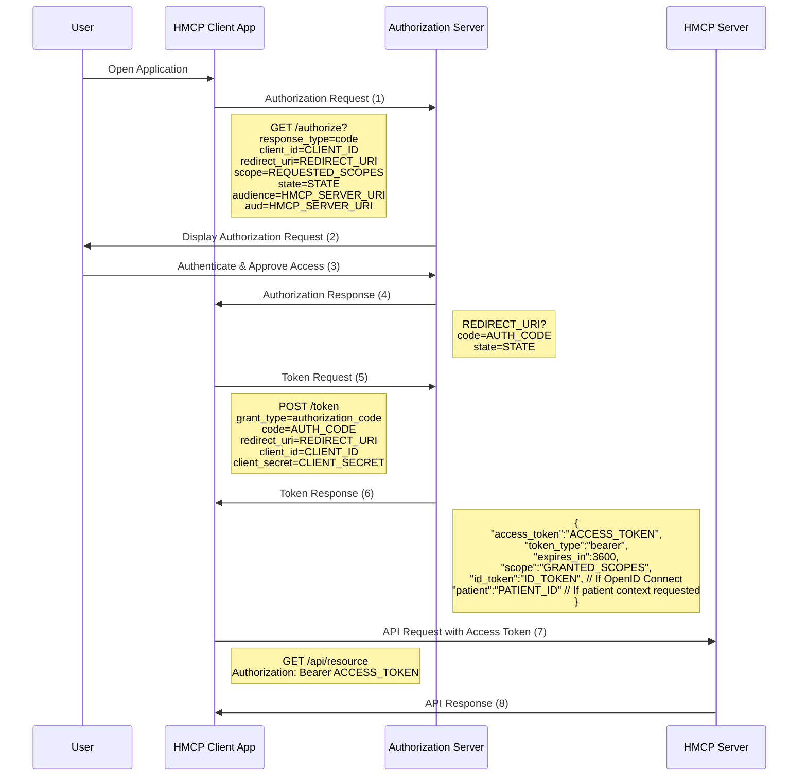
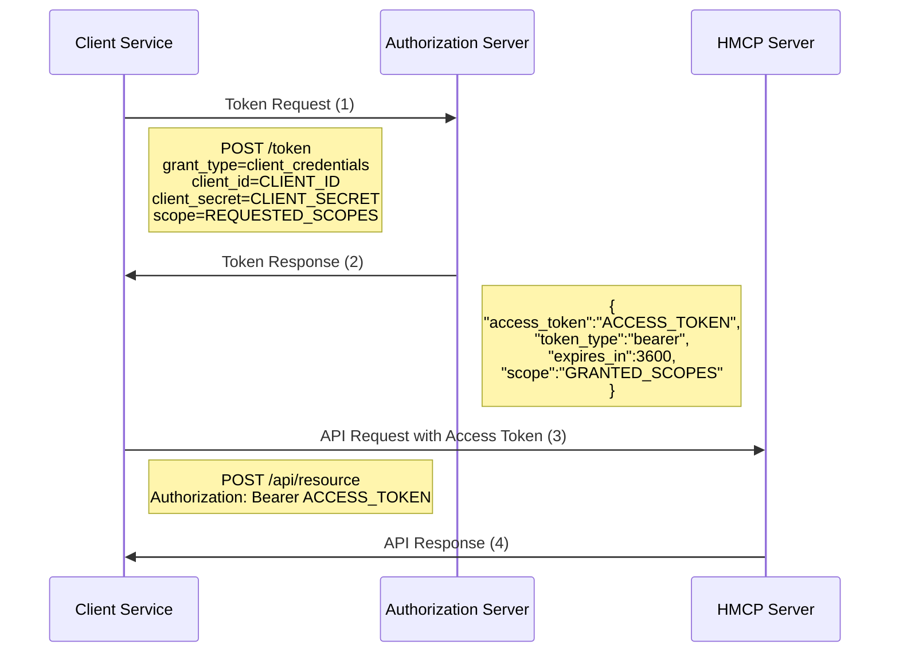

# Authentication, Authorization & Scopes

HMCP adopts the SMART on FHIR authentication and authorization framework, which builds upon OAuth 2.0 and OpenID Connect standards to provide secure, standardized access to healthcare data.

## Authentication Flows

HMCP supports two primary authentication flows:

### 1. OAuth 2.0 Authorization Code Flow (User-Mediated)

Used when an application needs to access data on behalf of a user. This flow requires user consent and authentication.



### 2. Client Credentials Flow (Service-to-Service)

Used for server-to-server authentication with no user involvement, typically with additional security like mTLS.



## Scopes in HMCP

HMCP uses scopes to control access permissions, following SMART on FHIR conventions:

### Scope Format

Scopes follow this format pattern:
```
[patient/][(read|write)].[resource]
```

Where:
- `patient/` prefix (optional): Restricts access to resources associated with the current patient context
- `read` or `write`: Indicates permission level
- `resource`: Specifies the resource type or action allowed

### Standard Scopes

| Scope | Description |
|-------|-------------|
| `hmcp:access` | Basic access to HMCP services |
| `hmcp:read` | Read access to HMCP resources |
| `hmcp:write` | Write access to HMCP resources |
| `patient/hmcp:read` | Read access limited to the current patient context |
| `patient/hmcp:write` | Write access limited to the current patient context |
| `openid` | Authentication using OpenID Connect |
| `profile` | Access to basic user profile information |
| `launch/patient` | Request patient context at launch time |
| `offline_access` | Request a refresh token for offline access |

### Patient Context in Scopes

For patient-specific operations, HMCP supports patient-context scopes. When using patient-context scopes:

1. The client requests both the resource scope with the `patient/` prefix and the `launch/patient` scope
2. The authorization server includes a `patient` parameter in the token response containing the patient ID
3. All operations using that token are automatically restricted to the specified patient

## OpenID Connect Integration

HMCP supports OpenID Connect for authentication with these features:

1. **ID Token**: Contains claims about user authentication and basic user identity
2. **UserInfo Endpoint**: Provides additional user attributes when requested
3. **Standard Claims**: Includes SMART on FHIR and healthcare-specific claims in tokens

To use OpenID Connect, include the `openid` scope in the authorization request along with any additional profile scopes.

## JWT Format and Claims

HMCP access tokens are JWTs with these standard claims:

```json
{
  "iss": "https://authorization-server.example.com",
  "sub": "user-or-client-id",
  "aud": "https://hmcp-server.example.com",
  "exp": 1656086400,
  "iat": 1656082800,
  "scope": "hmcp:read patient/hmcp:write",
  "patient": "123456",
  "tenant": "organization-id",
  "acr": "level-of-assurance",
  "fhirUser": "Practitioner/789"
}
```

## Token Storage and Security

Clients must securely store tokens following these guidelines:

1. Store access tokens in memory when possible, not in localStorage or cookies
2. For native apps, use secure operating system credential storage
3. Use refresh tokens to obtain new access tokens instead of long-lived tokens
4. Implement proper token validation on both client and server sides
5. Verify all claims, including audience (`aud`) and issuer (`iss`)