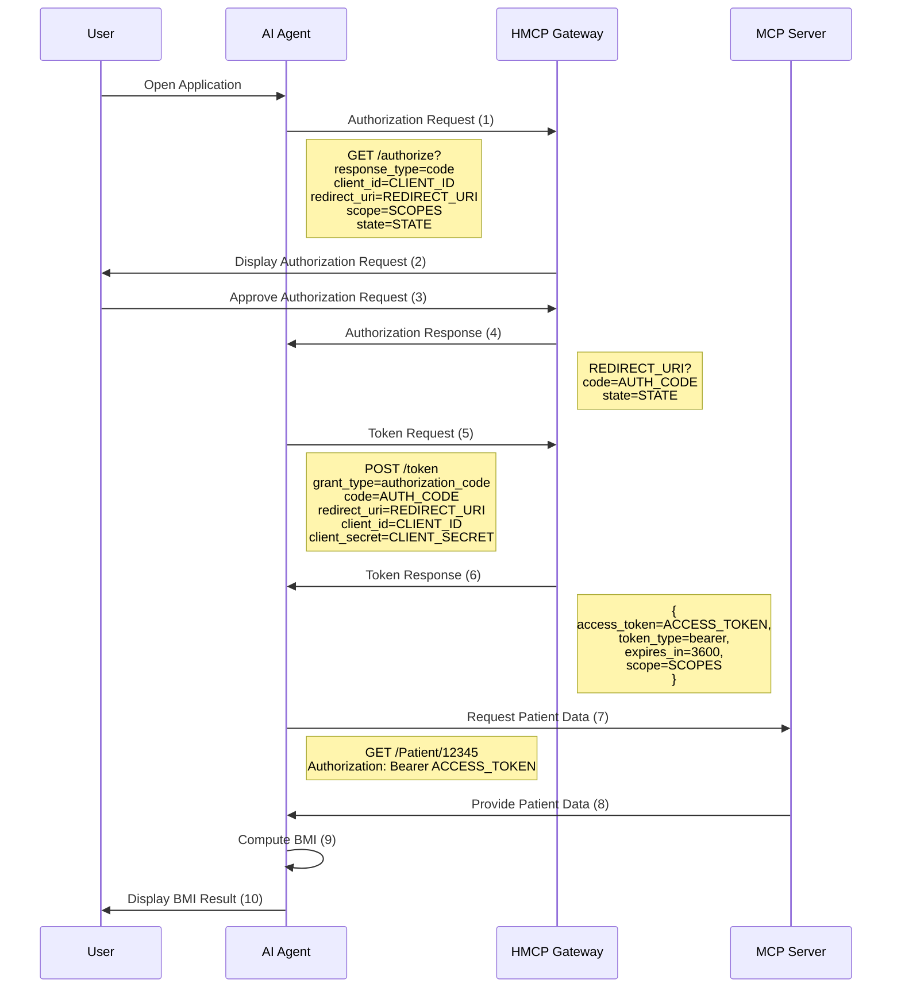

# Authentication, Authorization & Scopes

We will use OAuth 2.0 protocol when authentication is needed where end user consent is needed.

If service to service communication is needed then we will use mTLS. 

## Example auth flow 

### Detailed Annotations for OAuth 2.0 Steps:
1. *Authorization Request:* The AI Agent redirects the user to the HMCP Gateway with a request to authorize access. This includes parameters like response_type=code, client_id, redirect_uri, scope, and state.
2. *Display Authorization Request:* The HMCP Gateway presents the user with a page to approve or deny the authorization request.
3. *Approve Authorization Request:* The user approves the request, granting the application permission to access their data.
4. *Authorization Response:* The HMCP Gateway redirects the user back to the AI Agent with an authorization code and the original state parameter.
5. *Token Request:* The AI Agent sends a POST request to the HMCP Gateway's token endpoint to exchange the authorization code for an access token. This request includes the grant_type=authorization_code, code, redirect_uri, client_id, and client_secret.
6. *Token Response:* The HMCP Gateway responds with a JSON object containing the access_token, token_type, expires_in, and scope.
7. *Request Patient Data:* The AI Agent uses the access token to request patient data from the MCP server, including the Authorization: Bearer ACCESS_TOKEN header.
8. *Provide Patient Data:* The MCP server responds with the requested patient data, such as height and weight.
9. *Compute BMI:* The AI Agent computes the BMI using the retrieved data.
10. *Display BMI Result:* Finally, the AI Agent displays the computed BMI result to the user.