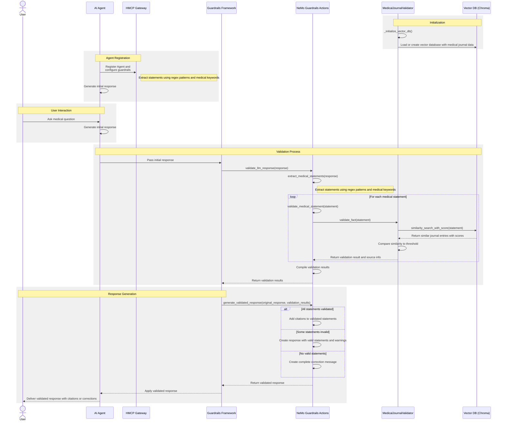

# Guardrails

Guardrails are an important differentiator of the HMCP protocol. We define guardrails as part of the `experimetal` capabilities of client and server. You can configure the exact guardrail which needs to be executed for each input/output of the agent (client or server).

Below we show an example of how guardrails can be implemented using Nvidia Nemo Guardrails library.

## Medical Journal Validation Flow

Below is an example of a guardrail which validates LLM response for clinical accuracy by checking against medical journals.

### Key Components

1. **User & LLM**: The entry point for medical questions and initial responses
2. **Guardrails Framework**: The infrastructure that intercepts LLM responses for validation
3. **NeMo Guardrails Actions**: Custom functions that process and validate medical content
4. **MedicalJournalValidator**: Core validation logic against medical literature
5. **Vector DB (Chroma)**: Database of medical journal information stored as vector embeddings

### Workflow Summary

1. System initializes with medical journal database
2. User asks a medical question, LLM generates a response
3. Response is intercepted by guardrails for validation
4. Medical statements are extracted and checked against journal data
5. System adds citations to validated statements or provides corrections for unverified information
6. Final validated response is delivered to the user

This validation system ensures that medical information provided by the LLM is backed by authoritative medical literature, increasing reliability and trustworthiness. 

