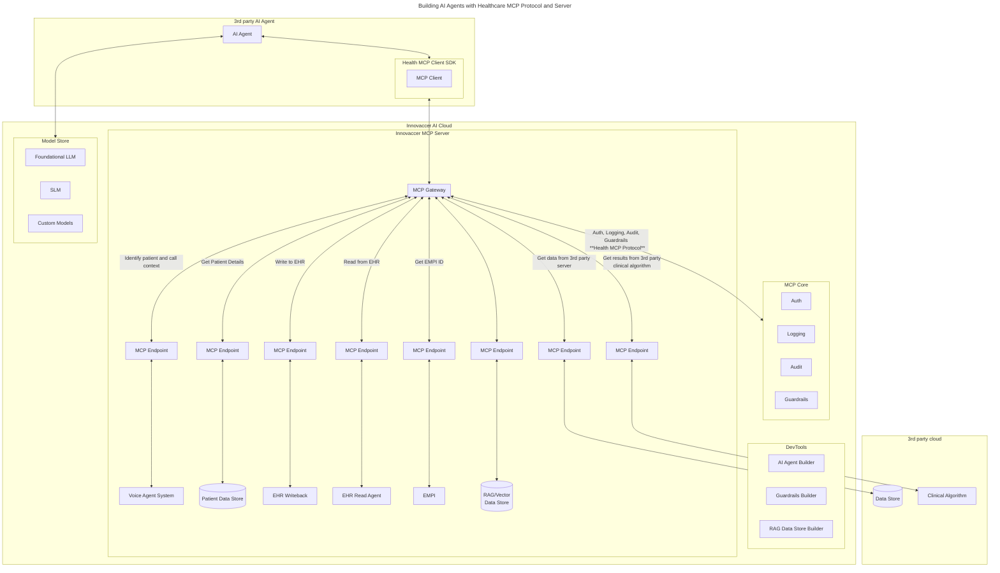

## Architecture Components

### Diagram



### Agent Card
- Each server side agent can define the agent card for clients to discover their configurations: (confirm this with MCP and A2A protocols)
    ```
    {
        name: Agent_Name,
        id: Unique Id for this deployment,
        Auth_Method : OAuth 2.0 or mTLS,
        Auth_Endpoint: Auth server URL,
        Capabilities: {
            Tools,
            List,
            Sampling,
            ...
        },
        Guardrails: {
            PHI_Redact,
            ...
        }
        Audit : Yes,

    }
    ```

### Other Features
- Allow to register agents and define capabilities
- Allow to define new guardrails
- Server will provide some default guardrails
- Server will provide access to Foundational/Custom LLM's & SLM's
- Allow to define authentication methods and provide certificate management for mTLS auth

## HMCP Protocol In-Depth

The aspects which we need to take care of are:
- Authentication & Authorization
    - Auth can be OAuth 2.0 or mTLS
- Guardrails
    - Define few example guardrails
- Logging/Auditing
- Agent Discovery
- Foundational LLM's discoverability
- Capabilities
- Registration of 3rd party agents
- Certificate management

### Authentication & Scopes
We will use OAuth 2.0 protocol when authentication is needed where end user token is needed. [OAuth Flow](./auth.md)

If service to service communication is needed then we will use mTLS.

### Guardrails

For guardrails we will use the Nvidia Nemo Guardrails library. Guardrails need to be defined 

Example [Validate LLM output against journals](./guardrails.md)

### Discoverability

### Patient Context

[Details](./context.md)
