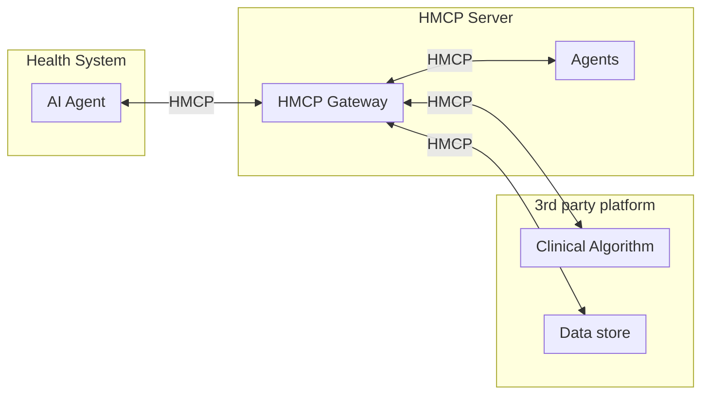

# HMCP Specification

Healthcare Model Context Protocol (HMCP) expands on base [MCP](https://modelcontextprotocol.io/specification/2025-03-26) by adding the below enhancements:
- [HMCP Specification](#hmcp-specification)
  - [Architecture Components](#architecture-components)
    - [Diagram](#diagram)
    - [Authentication \& Scopes](#authentication--scopes)
      - [Comparison of MCP vs HMCP Authentication](#comparison-of-mcp-vs-hmcp-authentication)
    - [Guardrails](#guardrails)
    - [Patient Context](#patient-context)
    - [Bi-directional agent to agent communication](#bi-directional-agent-to-agent-communication)
    - [_TODO_:](#todo)

## Architecture Components

### Diagram

### Authentication & Scopes
HMCP implements OAuth 2.0 and OpenID Connect following the SMART on FHIR authorization framework model. This approach provides a standardized, secure method for healthcare applications to authenticate and obtain appropriately scoped access to clinical data.

Two primary authentication mechanisms are supported:

1. **OAuth 2.0 for user-mediated contexts** - When end-user consent and context is needed
2. **mTLS (Mutual TLS)** - For secure service-to-service communication

For detailed implementation examples and flows, see the [Authentication Implementation Guide](./auth.md).

#### [Comparison of MCP vs HMCP Authentication](./hmcp_auth_vs_mcp_auth.md)

### Guardrails

For guardrails we will use the Nvidia Nemo Guardrails library. Guardrails need to be defined 

Example [Validate LLM output against journals](./guardrails.md)

### Patient Context

[Details](./context.md)

### Bi-directional agent to agent communication

[Sampling](./sampling.md)

### _TODO_:

- Add JSON specification
- Add ability to define guardrails in specification/ or in experimental capabilities
- Publish agent card
- Add capability negotiation in client for sampling
- Added section on bi-directional agent communication
- Add a sequence diagram showing the complete flow with auth and guardrails