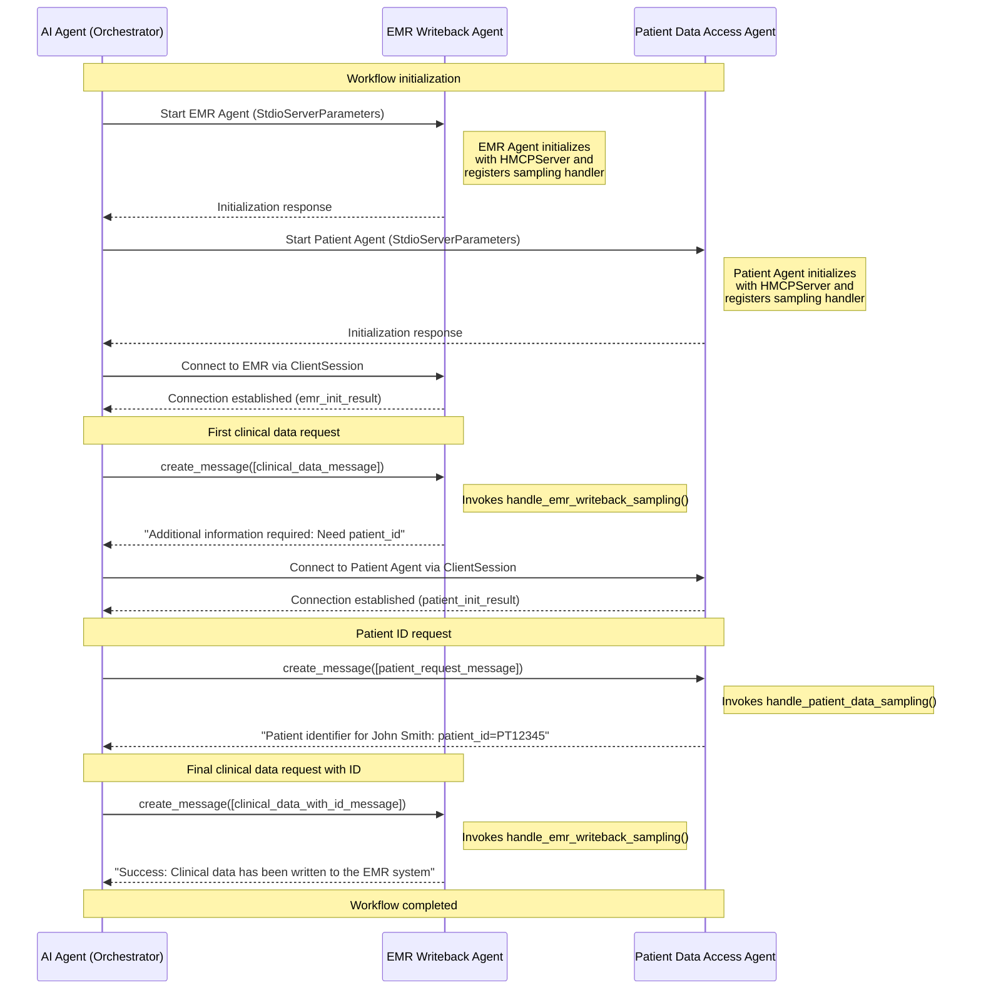
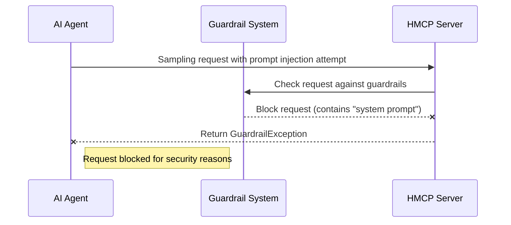

# Agent to Agent Bidirectional Communication

Agent to agent bidirectional communication is implemented by adding [sampling](https://modelcontextprotocol.io/specification/2025-03-26/client/sampling) capability to the HMCP server. The base MCP implementation already has sampling implemented on the client. That way HMCP client and server both can communicate using LLM inputs and output.

## Overview

In standard MCP, only servers can request language model generations or completions from clients. HMCP extends this functionality by implementing sampling capabilities on servers as well, enabling bidirectional communication between AI agents. This allows for:

- Multiple agents to collaborate on complex healthcare workflows with security and compliance guarantees

## Capabilities and Advertisement

HMCP Server defines `sampling` as a sub-capability under the [experimental](https://modelcontextprotocol.io/specification/2025-03-26/basic/lifecycle#capability-negotiation) capability. During initialization, an HMCP server advertises its sampling capabilities to clients:

```json
{
  "capabilities": {
    "experimental": {
      "hmcp": {
        "sampling": true,
        "version": "0.1.0"
      }
    }
  }
}
```

This advertisement ensures clients are aware of the server's ability to handle sampling requests.

## Implementation and Configuration

### Server-Side Implementation

To implement an HMCP server with bidirectional communication:

1. **Create an HMCPServer instance:**

```python
from hmcp.mcpserver.hmcp_server import HMCPServer
from hmcp.mcpserver.guardrail import Guardrail

# Initialize the server
server = HMCPServer(
    name="Healthcare Agent",
    version="1.0.0",
    host="0.0.0.0",
    port=8050,
    instructions="This agent provides healthcare information services."
)

# Optional: Initialize guardrail for security
guardrail = Guardrail()
```

2. **Register a sampling callback function:**

```python
@server.sampling()
async def handle_sampling_requests(context, params):
    """Process incoming sampling requests."""
    # Extract the message content
    latest_message = params.messages[-1]
    message_content = ""
    if isinstance(latest_message.content, types.TextContent):
        message_content = latest_message.content.text
    
    # Optional: Apply guardrails for security
    await guardrail.run(message_content)
    
    # Process the message and generate a response
    # ...custom processing logic...
    
    return types.CreateMessageResult(
        model="healthcare-model",
        role="assistant",
        content=types.TextContent(
            type="text",
            text="Response to the client's request"
        ),
        stopReason="endTurn"
    )
```

3. **Run the server:**

```python
# Start the server with SSE transport
server.run(transport="sse")
```

### Client-Side Implementation

To communicate with an HMCP server that supports sampling:

1. **Connect to the server:**

```python
from hmcp.mcpclient.hmcp_client import HMCPClient
from mcp import ClientSession
from mcp.client.sse import sse_client
from mcp.types import SamplingMessage, TextContent

# Authentication setup (if required)
auth_headers = oauth_client.get_auth_header()

# Connect to the HMCP server
async with sse_client("http://localhost:8050/sse", headers=auth_headers) as (read_stream, write_stream):
    async with ClientSession(read_stream, write_stream) as session:
        # Initialize the HMCP client
        client = HMCPClient(session)
        init_result = await session.initialize()
```

2. **Send a sampling request:**

```python
# Create a message
message = SamplingMessage(
    role="user",
    content=TextContent(
        type="text",
        text="What is the recommended treatment for hypertension?"
    )
)

# Send the request and get a response
result = await client.create_message(messages=[message])

# Process the response
if hasattr(result.content, 'text'):
    response_text = result.content.text
    print(f"Agent response: {response_text}")
```

## Message Structure

HMCP uses JSON-RPC for message exchange. Below are examples of the actual JSON messages exchanged during bidirectional communication:

### Client to Server Request

```json
{
  "jsonrpc": "2.0",
  "id": 1,
  "method": "sampling/createMessage",
  "params": {
    "messages": [
      {
        "role": "user",
        "content": {
          "type": "text",
          "text": "clinical_data={\"diagnosis\": \"Hypertension\", \"blood_pressure\": \"140/90\", \"medication\": \"Lisinopril 10mg\"}"
        }
      }
    ],
    "modelPreferences": {
      "hints": [
        {"name": "healthcare-model"}
      ],
      "intelligencePriority": 0.8,
      "speedPriority": 0.5
    },
    "maxTokens": 1000
  }
}
```

### Server to Client Response

```json
{
  "jsonrpc": "2.0",
  "id": 1,
  "result": {
    "role": "assistant",
    "content": {
      "type": "text",
      "text": "Additional information required: Need patient_id to associate with this clinical data."
    },
    "model": "emr-writeback-agent",
    "stopReason": "endTurn"
  }
}
```

### Follow-up Client Request with Additional Data

```json
{
  "jsonrpc": "2.0",
  "id": 2,
  "method": "sampling/createMessage",
  "params": {
    "messages": [
      {
        "role": "user",
        "content": {
          "type": "text",
          "text": "clinical_data={\"diagnosis\": \"Hypertension\", \"blood_pressure\": \"140/90\", \"medication\": \"Lisinopril 10mg\"} patient_id=PT12345"
        }
      }
    ],
    "maxTokens": 1000
  }
}
```

### Error Response (When Guardrails Block a Request)

```json
{
  "jsonrpc": "2.0", 
  "id": 3, 
  "error": {
    "code": -1, 
    "message": "Request blocked by guardrails"
  }
}
```

## Message Flow in a Multi-Agent System

The following diagram depicts the message flow in a multi-agent healthcare scenario as implemented in the HMCP Demo:



## Security and Guardrails in Bidirectional Communication

Bidirectional communication introduces additional security concerns. HMCP addresses these with:

1. **Authentication and Authorization**: All sampling requests require OAuth 2.0 authentication with appropriate scopes
2. **Guardrails**: Automatic validation of all messages passing between agents to prevent prompt injection
3. **Audit Logging**: Comprehensive logging of all communications for compliance requirements

Example of a sampling request blocked by guardrails:



## Use Cases for Bidirectional Agent Communication

HMCP's bidirectional communication enables several healthcare-specific workflows:

1. **Clinical Decision Support**: Specialized agents providing evidence-based recommendations
2. **Data Transformation**: Converting unstructured clinical notes to structured data
3. **Multi-agent Workflows**: Complex healthcare processes involving multiple specialized agents
4. **Federated Knowledge**: Accessing domain-specific knowledge without requiring all agents to have complete healthcare knowledge

By implementing sampling on both clients and servers, HMCP creates a flexible ecosystem of healthcare AI agents that can collaborate securely and efficiently.

