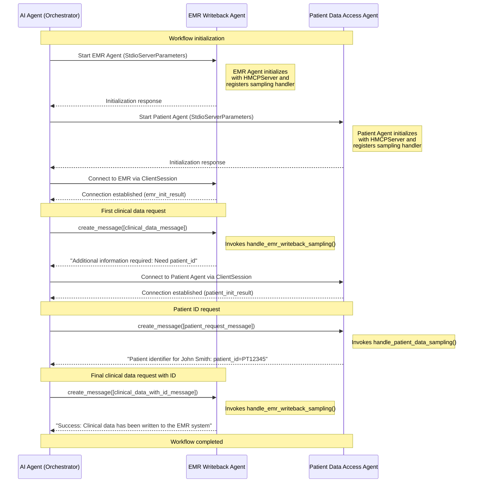

# Agent to Agent bi-directional communication

Agent to agent bi-directional communication is implemented by adding [sampling](https://modelcontextprotocol.io/specification/2025-03-26/client/sampling) capability to the HMCP server. The base MCP implementation already has sampling implemented on the client. That way HMCP client and server both can communicate using LLM inputs and output.

## Capabilities

HMCP Server defines `sampling` as a sub-capability under the [experimental](https://modelcontextprotocol.io/specification/2025-03-26/basic/lifecycle#capability-negotiation) capability. 

## Message Flow

Depicting the flow as described in the HMCP Demo files (under examples folder)

