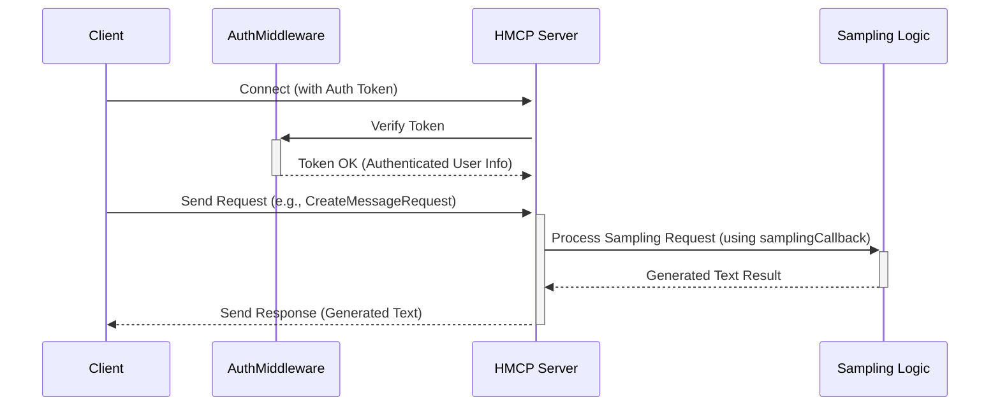

# Chapter 1: HMCP Server

Welcome to the Healthcare-MCP project! We're excited to guide you through its core components. This first chapter introduces the **HMCP Server**, the central hub of our system.

## What's the Big Idea?

Imagine you're building a smart assistant for doctors. This assistant needs to understand requests, fetch patient information, and sometimes even *generate* text, like drafting a quick summary of a patient's recent lab results or suggesting follow-up appointment wording.

Doing this securely and efficiently requires a central "brain" or coordinator. That's where the **HMCP Server** comes in. It's the engine that listens for requests from applications (like our doctor's assistant) and figures out how to respond, especially when it comes to healthcare-specific tasks like generating text summaries.

Think of it like a highly specialized help desk manager in a hospital. This manager (our HMCP Server) doesn't just route simple information requests ("Where is patient X's file?"). It can also *create* new documents based on instructions ("Draft a brief discharge summary using these key points"). And, crucially, it always checks the ID badge (authenticates) of anyone making a request to ensure only authorized personnel get access.

## What is the HMCP Server?

The HMCP Server is the main **server component** in the Healthcare-MCP project. Here's what it does:

1.  **Listens:** It constantly listens for incoming connections from client applications (which we'll cover in [Chapter 2: HMCP Client](02_hmcp_client_.md)).
2.  **Authenticates:** It checks if the client application has the correct permissions to make requests. This is vital for healthcare data security. We'll explore this more in [Chapter 3: Authentication (OAuth & JWT)](03_authentication__oauth___jwt__.md).
3.  **Handles Requests:** It processes requests based on the MCP (Model Context Protocol) standard – a set of rules for communication.
4.  **Generates Text (Sampling):** This is its special healthcare superpower! It can generate new text based on prompts and context provided by the client. We call this "sampling". This is perfect for tasks like summarizing notes, drafting messages, or answering questions based on medical information. We'll dive deep into this in [Chapter 4: Sampling Functionality](04_sampling_functionality_.md).

It builds upon a more general `MCP Server` but adds these specific healthcare features, especially authentication and text generation (sampling).

## Getting Started: Running a Basic Server

While a real-world server involves more setup (like authentication details), let's see the basic structure of how you might create and start an HMCP Server using the `HMCPServer` class.

```python
# Import the necessary class
from hmcp.mcpserver.hmcp_server import HMCPServer

# 1. Create an instance of the server
#    We give it a name clients will see.
#    We'll ignore auth_config and samplingCallback for now.
hmcp_server = HMCPServer(
    name="My First HMCP Server",
    host="127.0.0.1",  # Listen only on the local machine
    port=8050,         # The "door number" the server listens at
    # auth_config=..., # We'll cover this later!
    # samplingCallback=..., # And this too!
)

# 2. Start the server (this would typically run forever)
#    In a real script, you might use: hmcp_server.run()
print(f"Server '{hmcp_server.name}' would run on {hmcp_server.host}:{hmcp_server.port}")
# In a real application, the next line would start the server loop:
# hmcp_server.run()
```

**Explanation:**

*   We import the `HMCPServer` class.
*   We create an *instance* of the server, giving it a name (`"My First HMCP Server"`) so clients know who they're talking to.
*   `host="127.0.0.1"` means the server only accepts connections from your own computer (localhost). `0.0.0.0` would mean it accepts connections from other computers on the network.
*   `port=8050` is like the specific door number on the host computer where the server listens for connections.
*   The commented-out lines (`auth_config`, `samplingCallback`) are where you'd plug in the security settings and the logic for generating text – we'll learn about those in later chapters!
*   Calling `hmcp_server.run()` (which we didn't *actually* run here to keep things simple) would start the server, making it ready to accept client connections.

## How it Works Under the Hood

Let's peek behind the curtain. What happens when a client sends a request, especially one asking the server to generate text?

**The Flow:**

1.  **Connection:** An [HMCP Client](02_hmcp_client_.md) connects to the HMCP Server's address and port.
2.  **Authentication Check:** The server, using its `AuthMiddleware`, checks the client's credentials (usually a secure token called a JWT). If the credentials are invalid or missing, access is denied. This uses concepts from [Authentication (OAuth & JWT)](03_authentication__oauth___jwt__.md) and the [JWT Handler](07_jwt_handler_.md).
3.  **Request Received:** If authentication succeeds, the server receives the client's request. This could be a standard MCP request or a special `CreateMessageRequest` for text generation (sampling).
4.  **Request Routing:**
    *   For standard requests, the underlying MCP framework handles them.
    *   For a `CreateMessageRequest`, the HMCP Server routes it to its specific "sampling handler".
5.  **Sampling (if requested):** The sampling handler uses the provided `samplingCallback` function (the logic you define for *how* to generate text) to create the response. This is detailed in [Sampling Functionality](04_sampling_functionality_.md).
6.  **Response Sent:** The server packages the result (either the requested data or the newly generated text) and sends it back to the client.

**Sequence Diagram:**

Here's a visual representation of a client asking the server to generate text (sampling):



**Key Code Components:**

*   **`HMCPServer` Class (`hmcp_server.py`):**
    *   Inherits from `FastMCP` (the base MCP server).
    *   The `__init__` method sets up the server name, address, port, authentication configuration ([Auth Configuration](06_auth_configuration_.md)), and the crucial `samplingCallback`.

    ```python
    # Inside src/hmcp/mcpserver/hmcp_server.py
    class HMCPServer(FastMCP):
        def __init__(
            self,
            name: str,
            host: str = "0.0.0.0",
            port: int = 8050,
            auth_config: Optional[AuthConfig] = None, # Authentication settings
            samplingCallback: SamplingFnT | None = None, # Text generation logic
            # ... other parameters
        ):
            super().__init__(name=name, host=host, port=port, ...) # Initialize base server
            self.auth_config = auth_config or AuthConfig() # Setup auth
            self._samplingCallback = samplingCallback or _default_sampling_callback # Store sampling logic
            self._registerSamplingHandler() # Link sampling requests to the logic
            # ... setup capabilities to tell clients we can do 'sampling'
    ```

*   **`AuthMiddleware` Class (`fastmcp_auth.py`):**
    *   This acts like a security guard for incoming requests.
    *   It intercepts every request (except for the login endpoint itself).
    *   It looks for the `Authorization` header, extracts the JWT token, and uses the [JWT Handler](07_jwt_handler_.md) to verify it.
    *   If verification fails, it sends back a `401 Unauthorized` or `403 Forbidden` error.
    *   If successful, it adds user information (like `client_id` and `scopes`) to the request state for later use.

    ```python
    # Inside src/hmcp/mcpserver/fastmcp_auth.py
    class AuthMiddleware(BaseHTTPMiddleware):
        def __init__(self, app, auth_config: AuthConfig):
            super().__init__(app)
            self.auth_config = auth_config
            self.jwt_handler = jwt_handler.JWTHandler(auth_config) # Uses the JWT Handler

        async def dispatch(self, request: Request, call_next):
            # Skip auth for login path
            if request.url.path == self.auth_config.OAUTH_TOKEN_URL:
                return await call_next(request)

            auth_header = request.headers.get("Authorization")
            if not auth_header:
                # No credentials? Send 401 Error!
                return JSONResponse(..., status_code=401)

            try:
                token = utils.parse_auth_header(auth_header)
                payload = self.jwt_handler.verify_token(token) # Verify!
                # ... check client_id, scopes, patient_id ...
                request.state.client_id = payload.get('sub') # Store client info
                # ...
                return await call_next(request) # Allow request to proceed
            except (InvalidTokenError, ScopeError, Exception) as e:
                # Problems? Send error response (401 or 403)
                return JSONResponse(..., status_code=401 or 403)
    ```

*   **`_registerSamplingHandler` Method (`hmcp_server.py`):**
    *   This internal method connects the specific MCP request type `CreateMessageRequest` (which clients use to ask for text generation) to the `_samplingCallback` function provided during server initialization.

    ```python
    # Inside HMCPServer class in src/hmcp/mcpserver/hmcp_server.py
    def _registerSamplingHandler(self):
        async def samplingHandler(req: types.CreateMessageRequest):
            ctx = self._mcp_server.request_context # Get request details
            # Call the actual text generation logic
            response = await self._samplingCallback(ctx, req.params)
            # ... format the response ...
            return formatted_response

        # Tell the underlying MCP server:
        # "When you get a CreateMessageRequest, call my samplingHandler function"
        self._mcp_server.request_handlers[types.CreateMessageRequest] = samplingHandler
    ```

## Conclusion

You've just met the HMCP Server – the core engine of the Healthcare-MCP project. You learned that it's like a specialized help desk manager that listens for requests, checks credentials securely, handles standard tasks, and has the unique ability to *generate* text (sampling) for healthcare scenarios. We saw a glimpse of how to create a basic server instance and peeked under the hood at the key components like Authentication Middleware and the Sampling Handler registration.

In the next chapter, we'll look at the other side of the coin: the application that *talks* to this server. Let's dive into the [Chapter 2: HMCP Client](02_hmcp_client_.md)!

