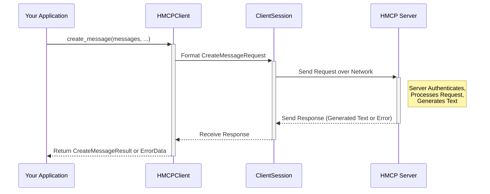

# Chapter 2: HMCP Client

In [Chapter 1: HMCP Server](01_hmcp_server_.md), we met the **HMCP Server** – the central brain or specialized help desk manager in our Healthcare-MCP system. It listens for requests, checks permissions, and can even generate text summaries.

But how does an application, like our smart doctor's assistant, actually *talk* to this server? It needs a way to connect and send its requests. That's where the **HMCP Client** comes in!

## What's the Big Idea?

Imagine you need to call that specialized hospital help desk (our HMCP Server). You can't just shout down the hallway; you need a phone or a specific communication device. You also need to know the right extension number and the correct way to phrase your request, especially if you're asking for something complex like drafting a document.

The **HMCP Client** is like that specialized communication device for your application. It's the software component your application uses to:

1.  **Connect:** Establish a connection to the correct HMCP Server.
2.  **Authenticate:** Prove it has permission to talk to the server (we'll cover this more in [Chapter 3: Authentication (OAuth & JWT)](03_authentication__oauth___jwt__.md)).
3.  **Send Requests:** Send standard requests (like asking for information) using the basic MCP rules.
4.  **Send *Special* Requests:** Specifically, it knows how to ask the server to generate text using the `createMessage` request (which triggers the server's [Sampling Functionality](04_sampling_functionality_.md)).

Think of it as the friendly assistant program that knows *exactly* how to format a request for the HMCP Server, including the special "please generate text for me" requests.

## What is the HMCP Client?

The HMCP Client is a software component built upon a more general `MCP ClientSession`. The `ClientSession` handles the basic network connection and communication rules (MCP). The `HMCPClient` adds the specific knowledge needed to interact with an *HMCP* Server, particularly for sending text generation requests.

It bundles up your application's requests into the correct format, sends them over the network connection managed by the `ClientSession`, and then unpacks the server's response for your application to use.

## How to Use the HMCP Client

Let's see how our doctor's assistant application might use the `HMCPClient` to ask the server to draft a simple patient message.

*(Note: Setting up the initial connection and authentication involves steps we'll cover in [Chapter 3: Authentication (OAuth & JWT)](03_authentication__oauth___jwt__.md). For now, let's assume we already have a connected and authenticated `ClientSession` called `my_session`.)*

**1. Create the HMCPClient Wrapper:**

Once you have a working connection (`my_session`), you wrap it with `HMCPClient` to get the extra features.

```python
# Import the necessary class
from hmcp.mcpclient.hmcp_client import HMCPClient
# Assume 'my_session' is an already connected and authenticated ClientSession
# (We'll learn how to create 'my_session' in Chapter 3!)

# Create the HMCPClient using the existing session
hmcp_client = HMCPClient(session=my_session)

print("HMCPClient is ready to send requests!")
```

**Explanation:**

*   We import the `HMCPClient` class.
*   We create an instance of `HMCPClient`, giving it the `my_session` object that handles the actual network communication.
*   Now, `hmcp_client` has methods specific to HMCP, like asking for text generation.

**2. Ask the Server to Generate Text (`create_message`):**

Now, let's use our `hmcp_client` to ask the server to generate a short message based on a prompt.

```python
import mcp.types as types # Import types for message formatting
import asyncio # Needed to run asynchronous code

async def ask_server_to_write():
    # Define the conversation history/prompt
    messages_to_send = [
        types.SamplingMessage(role="user", content="Draft a brief reminder for a patient about their upcoming check-up tomorrow at 10 AM.")
    ]

    print("Sending request to server to draft a message...")
    # Use the HMCP Client to send the 'createMessage' request
    response = await hmcp_client.create_message(
        messages=messages_to_send,
        maxTokens=50 # Limit the response length
    )

    # Check if the server sent back a successful result
    if isinstance(response, types.CreateMessageResult):
        # Print the generated text from the assistant
        generated_message = response.choices[0].message.content
        print(f"Server Response:\n{generated_message}")
    else:
        # Or print an error if something went wrong
        print(f"Server returned an error: {response.message}")

# To run this async function in a simple script:
# asyncio.run(ask_server_to_write())
```

**Explanation:**

*   We import `types` to correctly format the messages we send.
*   We create a list called `messages_to_send`. Here, it just contains one message from the "user" (our application) asking the server to draft a reminder.
*   We call the `hmcp_client.create_message()` method. This is the special HMCP function!
    *   `messages`: We pass our list of messages.
    *   `maxTokens`: We tell the server to keep the generated response relatively short.
*   The `await` keyword means our program waits politely for the server's response.
*   We check the `response`. If it's a `CreateMessageResult`, we print the generated text found inside `response.choices[0].message.content`. If not, we print the error message.

**Expected Output (Example):**

```
Sending request to server to draft a message...
Server Response:
Hi [Patient Name], this is a friendly reminder about your check-up appointment tomorrow at 10:00 AM. We look forward to seeing you!
```

*(The exact text will depend on the AI model configured on the [HMCP Server](01_hmcp_server_.md) and its [Sampling Functionality](04_sampling_functionality_.md).)*

## How it Works Under the Hood

What happens when you call `hmcp_client.create_message()`?

**The Flow:**

1.  **Packaging:** The `HMCPClient` takes the details you provided (messages, maxTokens, etc.) and packages them into a specific format called a `CreateMessageRequest`. This is like putting your request into a standardized envelope.
2.  **Sending:** The `HMCPClient` tells the underlying `ClientSession` (the basic communication handler) to send this packaged request over the established network connection to the HMCP Server.
3.  **Server Processing:** The [HMCP Server](01_hmcp_server_.md) receives the request. It first checks authentication (using info from [Chapter 3: Authentication (OAuth & JWT)](03_authentication__oauth___jwt__.md)). If okay, it understands it's a `CreateMessageRequest` and uses its text generation logic ([Sampling Functionality](04_sampling_functionality_.md)) to create the response.
4.  **Receiving:** The `ClientSession` on the client side receives the response packet from the server.
5.  **Unpacking:** The `HMCPClient` (or the `ClientSession` it uses) unpacks the response, checks if it's the expected type (`CreateMessageResult` or an `ErrorData`), and returns it to your application code.

**Sequence Diagram:**

Here's a simplified view of the `create_message` call:



**Key Code Components:**

*   **`HMCPClient` Class (`src/hmcp/mcpclient/hmcp_client.py`):**
    *   The `__init__` method simply stores the `ClientSession` that handles the connection.

    ```python
    # Inside src/hmcp/mcpclient/hmcp_client.py
    class HMCPClient:
        def __init__(self, session: ClientSession):
            """Initialize using an existing MCP ClientSession."""
            self.session = session # Store the session for communication
    ```

    *   The `create_message` method builds the request object and uses the session to send it.

    ```python
    # Inside src/hmcp/mcpclient/hmcp_client.py
    async def create_message(
        self, 
        messages: List[types.SamplingMessage],
        # ... other parameters like maxTokens ...
    ) -> Union[types.CreateMessageResult, types.ErrorData]:
        
        # 1. Package parameters into the standard format
        params = types.CreateMessageRequestParams(
            messages=messages,
            # ... maxTokens, temperature, etc. ...
        )
        
        # 2. Create the specific request type
        createMessageRequest = types.CreateMessageRequest(
            method="sampling/createMessage", # Standard name for this request
            params=params
        )
            
        logger.debug(f"Sending sampling request: {createMessageRequest}")

        # 3. Use the session to send the request and get the response
        #    It expects either a CreateMessageResult or an error.
        return await self.session.send_request(
            types.ClientRequest(createMessageRequest), 
            types.CreateMessageResult
        )
    ```

## Conclusion

You've now met the **HMCP Client**, the application's tool for communicating with the HMCP Server. You learned that it builds on a basic connection (`ClientSession`) and adds the specific ability to send requests like `create_message` to ask the server for generated text. We saw how to wrap a session with `HMCPClient` and use `create_message` to interact with the server's sampling capabilities.

But how does the client get permission to talk to the server in the first place? How does the server know who the client is and what it's allowed to do? That crucial step is **Authentication**. In the next chapter, we'll explore how the HMCP framework handles security using industry standards.

Let's dive into [Chapter 3: Authentication (OAuth & JWT)](03_authentication__oauth___jwt__.md)!
