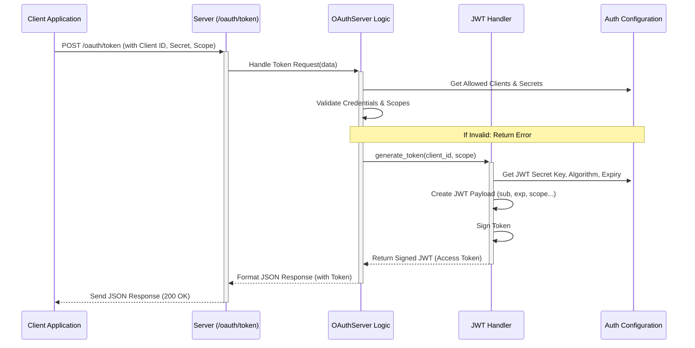

# Chapter 3: Authentication (OAuth & JWT)

In [Chapter 2: HMCP Client](02_hmcp_client_.md), we saw how our application (like a doctor's assistant) can use the `HMCPClient` to send requests, especially special ones like asking the [HMCP Server](01_hmcp_server_.md) to generate text.

But wait! The HMCP Server often deals with sensitive healthcare information. We can't just let *any* application connect and ask for data or generate text. We need a security system. How does the server know *who* is making the request, and if they *have permission* to do so?

This chapter introduces **Authentication**, the process of verifying identity and permissions in the Healthcare-MCP project.

## What's the Problem? Security!

Imagine our doctor's assistant application needs to fetch patient details or draft a message based on a patient's record. The HMCP Server holding this information needs to be absolutely sure that:

1.  The application requesting the data is legitimate and known (it's not some random program trying to snoop).
2.  The application has the *right permissions* (or "scopes") for the specific action it wants to perform (e.g., maybe it can read general notes but not billing information).

Think of the HMCP Server like a secure building (e.g., a hospital records room). You can't just walk in. You need to go to the security checkpoint at the entrance.

## The Security Checkpoint: OAuth 2.0 and JWT

Our security checkpoint uses two standard industry tools:

1.  **OAuth 2.0 (Client Credentials Flow):** This is the *process* for an application (our client) to get permission. Think of it as the procedure the security guard follows. The application presents its credentials (like a company ID badge and a secret password) to a specific "authentication desk" (`/oauth/token` endpoint) on the server. If the credentials are valid, the guard grants access. We specifically use the "Client Credentials" flow, which is designed for applications talking directly to servers (machine-to-machine).
    *   **Analogy:** It's like a delivery driver showing their company ID and a specific delivery order form to the hospital loading dock security to get temporary access.

2.  **JWT (JSON Web Tokens):** This is the *format* of the temporary access pass the server issues once the application proves its identity. It's a compact, secure string of characters that contains information about who the application is and what it's allowed to do (its "scopes").
    *   **Analogy:** It's like a secure, digitally signed temporary ID card or key fob issued by the security guard. This card (the JWT) clearly states your name (Client ID) and which doors (scopes) you can open, and it has an expiry time. It's designed to be tamper-proof.

**Key Terms:**

*   **Client ID:** A public identifier for the application, like a username.
*   **Client Secret:** A confidential password known only to the application and the server. **Keep this secret!**
*   **Scope:** A specific permission (e.g., `hmcp:access` to connect, `patient/hmcp:read` to read patient-related info).
*   **Access Token (JWT):** The temporary pass (in JWT format) issued by the server after successful authentication. The client includes this token with every subsequent request.

## How the Client Gets an Access Token

Before the `HMCPClient` can make requests like `create_message`, it first needs to get an Access Token (a JWT) from the server's authentication endpoint. Here's the simplified flow:

1.  **Client Prepares:** The client application knows its `client_id` and `client_secret`.
2.  **Client Asks for Token:** It sends these credentials to the server's special authentication URL (e.g., `http://your-hmcp-server.com/oauth/token`).
3.  **Server Checks:** The server receives the request, checks if the `client_id` exists in its list of allowed clients ([Auth Configuration](06_auth_configuration_.md)), and verifies the `client_secret`.
4.  **Server Issues Token:** If credentials are valid, the server generates a JWT Access Token containing the `client_id` and the scopes this client is allowed to use.
5.  **Client Receives Token:** The server sends the Access Token back to the client.

Now the client can use this token to make actual API calls!

**Example: Using `OAuthClient` to Get a Token**

The `hmcp` library provides helpers for this. Let's see how a client might get a token.

```python
# Assume necessary imports and config setup
from hmcp.auth import AuthConfig, OAuthClient, ClientValidationError
import httpx # A library to make web requests
import asyncio

# --- Configuration (Usually loaded securely) ---
SERVER_URL = "http://127.0.0.1:8050" # Where the HMCP server is running
CLIENT_ID = "test-client"
CLIENT_SECRET = "test-secret" # Keep this safe!

# Load server's expected auth settings (needed by the client helper)
# In a real app, parts of this might come from the server's discovery endpoint
auth_config = AuthConfig(
    ALLOWED_CLIENTS={CLIENT_ID: {"secret": CLIENT_SECRET, "scopes": ["hmcp:access"]}},
    OAUTH_TOKEN_URL="/oauth/token" # The path for getting tokens
)

# --- Function to get the token ---
async def get_access_token():
    try:
        # 1. Create the helper client
        oauth_client = OAuthClient(
            client_id=CLIENT_ID,
            client_secret=CLIENT_SECRET,
            config=auth_config
        )

        # 2. Prepare the request data (using the helper)
        token_request_data = oauth_client.create_token_request(
            scopes=["hmcp:access"] # Ask for specific permissions
        )
        print(f"Asking for token with data: {token_request_data}")

        # 3. Make the actual web request to the server's token endpoint
        async with httpx.AsyncClient() as client:
            response = await client.post(
                f"{SERVER_URL}{auth_config.OAUTH_TOKEN_URL}",
                data=token_request_data
            )
            response.raise_for_status() # Raise an error for bad responses (like 401)
            token_response = response.json() # Get the JSON response

        # 4. Store the token (using the helper)
        oauth_client.set_token(token_response)
        print(f"Success! Received Access Token: {oauth_client.access_token[:15]}...")
        return oauth_client.access_token

    except (ClientValidationError, httpx.HTTPStatusError) as e:
        print(f"Authentication failed: {e}")
        return None

# --- Run the function (in a real app, this token is stored and used) ---
# access_token = asyncio.run(get_access_token())
# if access_token:
#    # Now you can use this token to make authenticated requests!
#    # The HMCPClient will use this token in its headers.
#    pass
```

**Explanation:**

1.  We set up our server URL, client ID, and secret. We also create an `AuthConfig` object (which the `OAuthClient` helper needs).
2.  We create an instance of `OAuthClient`, giving it our credentials and config.
3.  `oauth_client.create_token_request` helps format the data we need to send to the server (including the `grant_type: client_credentials`).
4.  We use the `httpx` library to send a `POST` request to the server's `/oauth/token` endpoint with the request data.
5.  If the server approves (doesn't return an error like 401 Unauthorized), we parse the JSON response.
6.  `oauth_client.set_token` stores the received `access_token` from the response inside the `oauth_client` object.
7.  We print the first part of the token to show we got it. In a real app, this token would be stored and passed to the `HMCPClient` (often automatically by setting it in the `ClientSession`'s headers) for making authenticated calls like `create_message`.

**Example Output (Success):**

```
Asking for token with data: {'client_id': 'test-client', 'client_secret': 'test-secret', 'grant_type': 'client_credentials', 'scope': 'hmcp:access'}
Success! Received Access Token: eyJhbGciOiJIUzI...
```

**Example Output (Failure - e.g., wrong secret):**

```
Asking for token with data: {'client_id': 'test-client', 'client_secret': 'wrong-secret', 'grant_type': 'client_credentials', 'scope': 'hmcp:access'}
Authentication failed: 401 Unauthorized for url `http://127.0.0.1:8050/oauth/token`
For more information check: https://httpstatuses.com/401
```

## How it Works Under the Hood: Server Side

When the client sends its credentials to `/oauth/token`, what happens on the [HMCP Server](01_hmcp_server_.md)?

**Walkthrough:**

1.  **Request Arrives:** The server's web framework (FastAPI/Starlette) routes the `POST` request to `/oauth/token` to the specific handler function designed for authentication.
2.  **Credentials Extracted:** The handler extracts the `client_id`, `client_secret`, `grant_type`, and requested `scope` from the request data.
3.  **Validation:** The `OAuthServer` logic checks:
    *   Is the `grant_type` supported (e.g., `client_credentials`)?
    *   Does the `client_id` exist in the allowed clients list ([Auth Configuration](06_auth_configuration_.md))?
    *   Does the provided `client_secret` match the stored secret for that client?
    *   Are the requested `scopes` allowed for this client?
4.  **Token Generation:** If validation passes, the `OAuthServer` calls the [JWT Handler](07_jwt_handler_.md) (`JWTHandler.generate_token`) to create the JWT Access Token. This involves:
    *   Creating a "payload" (a dictionary) containing claims like `sub` (subject/client\_id), `iss` (issuer), `exp` (expiry time), `aud` (audience - who the token is for), and `scope`.
    *   Signing the payload using the server's secret key (`JWT_SECRET_KEY`) and algorithm (`JWT_ALGORITHM`) from the [Auth Configuration](06_auth_configuration_.md).
5.  **Response Sent:** The `OAuthServer` packages the generated JWT into a JSON response (like `{"access_token": "...", "token_type": "Bearer", ...}`) and sends it back to the client with a `200 OK` status.

**Sequence Diagram (Token Request):**



**Key Server Code Snippets:**

*   **OAuth Token Endpoint Handler (Conceptual - part of the web server setup):** This function receives the web request.

    ```python
    # Conceptual handler for POST /oauth/token
    # (Actual implementation uses FastAPI/Starlette routing)
    async def handle_token_request(request: Request):
        form_data = await request.form()
        client_id = form_data.get("client_id")
        client_secret = form_data.get("client_secret")
        # ... get grant_type, scope ...

        try:
            # Assume 'oauth_server' is an instance of OAuthServer
            # 1. Validate client (simplified)
            if not oauth_server.validate_client(client_id, client_secret):
                 raise ClientValidationError("Invalid credentials")

            # 2. Check scopes are allowed for this client (simplified)
            # ... scope validation logic ...

            # 3. Create the token
            token_response = oauth_server.create_token(
                client_id=client_id,
                scope=form_data.get("scope", "")
            )
            return JSONResponse(content=token_response, status_code=200)

        except (ClientValidationError, ScopeError) as e:
            return JSONResponse(content={"error": str(e)}, status_code=401) # Or 403
    ```

*   **`OAuthServer.create_token` (from `src/hmcp/auth/oauth_server.py`):** This orchestrates token creation.

    ```python
    # Inside src/hmcp/auth/oauth_server.py (simplified)
    class OAuthServer:
        def __init__(self, config: AuthConfig):
            self.config = config
            # The JWT Handler does the actual JWT work
            self.jwt_handler = JWTHandler(config)
            # ... (client registration logic omitted) ...

        def create_token(self, client_id: str, scope: str, patient_id: str = None) -> Dict:
            # Calls the JWT Handler to generate the token string
            token = self.jwt_handler.generate_token(client_id, scope, patient_id)

            # Packages the token into the standard OAuth2 response format
            response = {
                'access_token': token,
                'token_type': 'Bearer',
                'expires_in': self.config.TOKEN_EXPIRY_HOURS * 3600,
                'scope': scope
            }
            # ... (add patient claim if needed) ...
            return response
    ```

*   **`JWTHandler.generate_token` (from `src/hmcp/auth/jwt_handler.py`):** This creates and signs the JWT. (See also [JWT Handler](07_jwt_handler_.md)).

    ```python
    # Inside src/hmcp/auth/jwt_handler.py (simplified)
    import jwt as pyjwt # The PyJWT library
    from datetime import datetime, timedelta

    class JWTHandler:
        def __init__(self, config: AuthConfig):
            self.config = config
            # ...

        def generate_token(self, client_id: str, scope: str, patient_id: str = None) -> str:
            # 1. Prepare the data (payload) inside the token
            now = datetime.utcnow()
            payload = {
                'iss': self.config.ISSUER,          # Who issued the token
                'sub': client_id,                   # Subject (who the token is about)
                'aud': self.config.JWT_AUDIENCE,    # Audience (who should accept it)
                'iat': now,                         # Issued At time
                'exp': now + timedelta(hours=self.config.TOKEN_EXPIRY_HOURS), # Expiry time
                'scope': scope                      # Granted permissions
            }
            # ... (add patient claim if needed) ...

            # 2. Use pyjwt library to encode and sign the token
            token = pyjwt.encode(
                payload,
                self.config.JWT_SECRET_KEY, # The crucial secret key!
                algorithm=self.config.JWT_ALGORITHM
            )
            return token
    ```

**What about using the token?**

Once the client has the token, it includes it in the `Authorization` header of subsequent requests (like the `create_message` request from Chapter 2):

`Authorization: Bearer eyJhbGciOiJIUzI...`

The `AuthMiddleware` on the server (discussed briefly in [Chapter 1: HMCP Server](01_hmcp_server_.md) and implemented in `src/hmcp/mcpserver/fastmcp_auth.py`) intercepts these requests. It extracts the token, uses the `JWTHandler.verify_token` method to check its signature, expiry, and claims (like scopes), and either allows the request to proceed or rejects it with an error (like `401 Unauthorized` or `403 Forbidden`).

## Conclusion

You've learned about the crucial role of Authentication in securing the HMCP Server. We saw how the server acts like a security checkpoint, using the **OAuth 2.0** standard (specifically the Client Credentials flow) as the process for applications to request access by providing their **Client ID** and **Client Secret**.

If successful, the server issues a **JWT Access Token** – a secure, temporary pass containing the client's identity and allowed **scopes** (permissions). The client then uses this token in the `Authorization` header for all future requests. We peeked at how the `OAuthClient` helps the client get a token and how the `OAuthServer` and [JWT Handler](07_jwt_handler_.md) work together on the server side to validate credentials and generate these secure tokens.

Now that we understand how a client gets permission to talk to the server, we can explore one of the server's most powerful features: its ability to generate text based on prompts.

Let's move on to [Chapter 4: Sampling Functionality](04_sampling_functionality_.md)!

