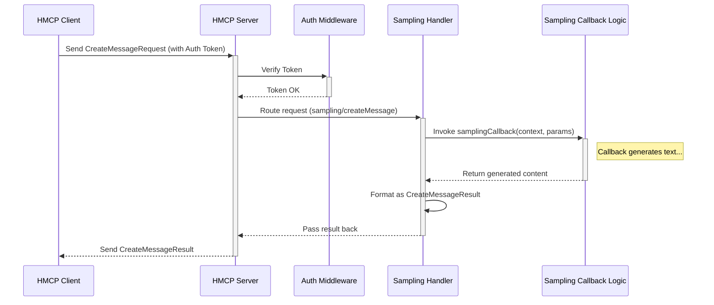

# Chapter 4: Sampling Functionality

In [Chapter 3: Authentication (OAuth & JWT)](03_authentication__oauth___jwt__.md), we learned how our client application proves its identity to the HMCP Server using secure tokens, ensuring only authorized applications can communicate. Now that the client has the key to the door, what special services can it access?

One of the most powerful and unique features the HMCP Server offers is the ability to **generate new text**. This isn't just about fetching existing files or data; it's about *creating* content. We call this **Sampling Functionality**.

## What's the Big Idea? Generating Text!

Imagine our doctor's assistant application. Sometimes, it needs information already stored, like a patient's address. But other times, it needs help *writing* something new:

*   "Draft a short, friendly reminder for the patient about their upcoming appointment."
*   "Summarize the key points from the last consultation notes."
*   "Suggest a possible response to this patient's question about medication side effects."

These tasks require creativity and language understanding, not just data retrieval. The standard MCP protocol doesn't cover this. This is where **Sampling Functionality**, the core extension provided by HMCP, comes in.

Think of a regular help desk versus a creative writing assistant.
*   **Regular Help Desk (like basic MCP):** "Where is file X?" -> "It's in cabinet Y." (Retrieval)
*   **Creative Assistant (like HMCP Sampling):** "Here are some notes, can you write a summary?" -> "Okay, here's a draft summary: ..." (Generation)

The HMCP Server acts like that creative assistant. The [HMCP Client](02_hmcp_client_.md) knows how to make these creative requests, and the [HMCP Server](01_hmcp_server_.md) knows how to fulfill them using its configured text generation capabilities (often powered by an AI language model).

## How the Client Asks for Generated Text

As we saw briefly in [Chapter 2: HMCP Client](02_hmcp_client_.md), the client uses the `create_message` method to ask the server to generate text. Let's look at a simple example again:

```python
# Assume 'hmcp_client' is an authenticated HMCPClient instance
import mcp.types as types
import asyncio

async def ask_for_summary():
    # The context or prompt for the server
    messages_to_send = [
        types.SamplingMessage(role="user", content="Summarize this note in one sentence: Patient reported mild headache after starting new medication Lisinopril. Vitals stable. No other complaints.")
    ]

    print("Asking server for a summary...")
    # Send the request using the client
    response = await hmcp_client.create_message(
        messages=messages_to_send,
        maxTokens=30 # Ask for a short response
    )

    # Check the result
    if isinstance(response, types.CreateMessageResult):
        summary = response.choices[0].message.content
        print(f"Server's Summary: {summary}")
    else:
        print(f"Error: {response.message}")

# To run this async function:
# asyncio.run(ask_for_summary())
```

**Explanation:**

1.  **`messages_to_send`**: This list provides the context or instruction. We include a message with `role="user"` containing the text we want summarized.
2.  **`hmcp_client.create_message(...)`**: This function sends the request.
    *   `messages`: The context we just defined.
    *   `maxTokens`: Limits the length of the generated text (optional). Other parameters like `temperature` (for creativity) can also be included.
3.  **`response`**: We wait for the server's answer.
4.  **Checking the `response`**:
    *   If successful, the response is a `types.CreateMessageResult`. The generated text is usually inside `response.choices[0].message.content`.
    *   If something went wrong (e.g., the server doesn't support sampling, or there was an internal error), it returns a `types.ErrorData`.

**Example Output:**

```
Asking server for a summary...
Server's Summary: The patient experienced a mild headache after starting Lisinopril but had stable vitals.
```

*(The exact wording depends on the AI model configured on the server.)*

This `create_message` call is the client's way of triggering the server's unique Sampling Functionality.

## How the Server Generates the Text (Under the Hood)

When the HMCP Server receives a `CreateMessageRequest`, how does it actually generate the response?

**The Flow:**

1.  **Request Received:** The [HMCP Server](01_hmcp_server_.md) receives the incoming `CreateMessageRequest` packet from the client.
2.  **Authentication:** The server's `AuthMiddleware` (using logic from [Chapter 3: Authentication (OAuth & JWT)](03_authentication__oauth___jwt__.md)) checks the client's JWT token included in the request headers to ensure the client is authenticated and has permission (`scope`) to perform sampling. If not, it rejects the request.
3.  **Routing:** The server recognizes the request method (`sampling/createMessage`) and routes it to its dedicated internal "Sampling Handler".
4.  **Callback Invoked:** The Sampling Handler calls a special function that was provided when the server was set up – the `samplingCallback`. This callback function contains the *actual logic* for how to generate text (e.g., calling an AI model). It receives the `messages` and other parameters (`maxTokens`, `temperature`, etc.) from the client's request.
5.  **Text Generation:** The `samplingCallback` function does its magic (perhaps calling an external AI service, running a local model, etc.) and produces the generated text content.
6.  **Formatting Response:** The Sampling Handler takes the generated content from the callback and formats it into a `CreateMessageResult` object.
7.  **Response Sent:** The server sends the `CreateMessageResult` back to the client.

**Sequence Diagram:**



## Server Implementation Details

How does the server *know* how to generate text? It relies on the `samplingCallback` function provided during its setup.

**1. Providing the Callback:**

When you create an instance of `HMCPServer`, you can pass your own custom function to handle the text generation logic.

```python
# --- Define your text generation logic ---
# (This is just a simple example; real logic might call an AI API)
async def my_custom_text_generator(context, params):
    # 'context' has info about the request
    # 'params' has messages, maxTokens, etc.
    user_prompt = params.messages[-1].content # Get the last user message
    
    # Simulate generating a response
    generated_text = f"I received your prompt: '{user_prompt}'. Here is a generated response."
    
    # Return the standard result format
    return types.CreateMessageResult(
        choices=[
            types.SamplingChoice(
                index=0,
                message=types.SamplingMessage(role="assistant", content=generated_text)
            )
        ]
    )

# --- Create the server, passing the callback ---
from hmcp.mcpserver.hmcp_server import HMCPServer
# Assume 'auth_config' is defined as in Chapter 3

hmcp_server = HMCPServer(
    name="My Generating Server",
    host="127.0.0.1",
    port=8050,
    auth_config=auth_config, # Authentication settings
    samplingCallback=my_custom_text_generator # Plug in our logic!
)

# Now, when this server runs and receives a CreateMessageRequest,
# it will call 'my_custom_text_generator'.
# hmcp_server.run()
```

**Explanation:**

*   We define an `async` function `my_custom_text_generator` that matches the required signature (`context`, `params`).
*   Inside, it retrieves the user's prompt from `params.messages`.
*   It simulates generating text (in reality, this would involve more complex logic, like calling a large language model).
*   It packages the generated text into the required `types.CreateMessageResult` format.
*   When creating the `HMCPServer`, we pass our function via the `samplingCallback` argument. If you don't provide one, the server uses a default callback that just returns a "Sampling not supported" error.

**2. Registering the Handler:**

Internally, the `HMCPServer` uses a method called `_registerSamplingHandler` during its initialization.

*(See `src/hmcp/mcpserver/hmcp_server.py`)*

```python
# Inside HMCPServer class in src/hmcp/mcpserver/hmcp_server.py
    def _registerSamplingHandler(self):
        # Define the internal handler function
        async def samplingHandler(req: types.CreateMessageRequest):
            ctx = self._mcp_server.request_context # Get request details
            # >>> Call the stored _samplingCallback function <<<
            response = await self._samplingCallback(ctx, req.params) 
            # ... format the response ...
            return formatted_response # e.g., ServerResult(response) or ErrorData

        # Tell the underlying MCP server:
        # When a 'CreateMessageRequest' arrives, use 'samplingHandler'
        self._mcp_server.request_handlers[types.CreateMessageRequest] = samplingHandler
```

**Explanation:**

*   This code (simplified) runs when the `HMCPServer` starts.
*   It defines an inner function `samplingHandler`.
*   Crucially, `samplingHandler` calls `self._samplingCallback` – the function we provided (like `my_custom_text_generator`) or the default one.
*   It then registers `samplingHandler` with the base MCP server, telling it: "Any time you see a `CreateMessageRequest`, give it to this function."

This mechanism connects the incoming client request (`CreateMessageRequest`) to the specific text generation logic (`samplingCallback`) you defined for your server.

**3. Client Side (`create_message`):**

Just to recap the client side from `src/hmcp/mcpclient/hmcp_client.py`:

```python
# Inside HMCPClient class in src/hmcp/mcpclient/hmcp_client.py
    async def create_message(
        self, 
        messages: List[types.SamplingMessage],
        # ... other parameters ...
    ) -> Union[types.CreateMessageResult, types.ErrorData]:
        
        # 1. Package parameters into standard format
        params = types.CreateMessageRequestParams(...)
        
        # 2. Create the request object with the specific method name
        createMessageRequest = types.CreateMessageRequest(
            method="sampling/createMessage", # The key method identifier
            params=params
        )

        # 3. Use the underlying session to send and wait for a response
        return await self.session.send_request(
            types.ClientRequest(createMessageRequest), 
            types.CreateMessageResult # Expect this type of result (or ErrorData)
        )
```

This shows how the client explicitly creates a request with `method="sampling/createMessage"`, which the server uses for routing, and expects a `CreateMessageResult` in return.

## Conclusion

In this chapter, we explored the core HMCP extension: **Sampling Functionality**. You learned that this isn't just about retrieving data, but about the server's unique ability to *generate* new text content based on client requests.

We saw how the [HMCP Client](02_hmcp_client_.md) uses the `create_message` method to send a `CreateMessageRequest` containing context and parameters. We then followed the request to the [HMCP Server](01_hmcp_server_.md), saw how it authenticates, routes the request, and invokes a specific `samplingCallback` function to perform the actual text generation. Finally, the server packages the result into a `CreateMessageResult` and sends it back.

This powerful generation capability is central to HMCP's purpose in healthcare AI applications. However, generating text, especially in a sensitive domain like healthcare, requires careful control and safety measures. How can we ensure the generated content is appropriate, safe, and follows specific rules?

That's where the next concept comes in. Let's explore how HMCP provides safety mechanisms in [Chapter 5: Guardrails](05_guardrails_.md)!

