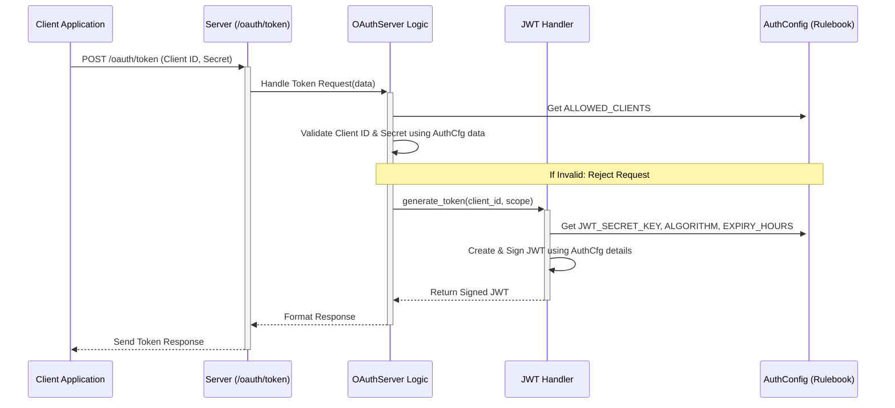

# Chapter 6: Auth Configuration

In [Chapter 5: Guardrails](05_guardrails_.md), we saw how to add safety layers to check *what* users can say or ask. But before we even get to the content of the request, the [HMCP Server](01_hmcp_server_.md) needs to know *who* is allowed to connect in the first place and how to verify their identity securely.

Think back to [Chapter 3: Authentication (OAuth & JWT)](03_authentication__oauth___jwt__.md). The client needed a `Client ID` and `Client Secret` to get an access token (JWT), and the server needed a secret key to create that token. Where does the server store all these critical security settings? We need a single, organized place to keep this "security rulebook".

That's exactly what **Auth Configuration** provides!

## What's the Big Idea? The Security Rulebook

Imagine setting up the security system for a new hospital wing. You need a master plan that lists:

*   Which companies (applications) are allowed access? (`ALLOWED_CLIENTS`)
*   What are their secret passcodes? (`secret` within `ALLOWED_CLIENTS`)
*   What specific areas (permissions/scopes) can each company access? (`scopes` within `ALLOWED_CLIENTS`)
*   What is the master secret code used to create the temporary security badges (JWTs)? (`JWT_SECRET_KEY`)
*   How long is each temporary badge valid? (`TOKEN_EXPIRY_HOURS`)
*   What's the official procedure for signing badges? (`JWT_ALGORITHM`)
*   Where is the security desk located where staff request their badges? (`OAUTH_TOKEN_URL`)
*   What are all the possible access areas (scopes) that exist in the building? (`OAUTH_SCOPES`)

The **Auth Configuration** in Healthcare-MCP is precisely this master security plan. It's a dedicated structure, usually an object created from the `AuthConfig` class, that holds all these crucial settings together in one place.

## What is Auth Configuration (`AuthConfig`)?

The `AuthConfig` class (found in `src/hmcp/auth/config.py`) acts as a container or blueprint for storing all authentication and authorization related settings for the HMCP Server.

Here are the key pieces of information it holds:

*   `JWT_SECRET_KEY`: This is the **most critical secret**. It's like the unique, confidential key used by the security office to emboss or digitally sign the temporary access badges (JWTs). Anyone with this key could potentially forge badges, so it must be kept extremely secure.
*   `JWT_ALGORITHM`: The specific cryptographic method used for signing the badges (e.g., "HS256"). This ensures everyone uses the same signing procedure.
*   `TOKEN_EXPIRY_HOURS`: How many hours a temporary access badge (JWT) is valid before it expires and the application needs to request a new one.
*   `ALLOWED_CLIENTS`: A dictionary listing all the applications (clients) that are permitted to request access. For each client, it stores:
    *   `secret`: The client's unique password (the `Client Secret`). Must be kept confidential.
    *   `scopes`: A list of permissions (like `hmcp:access` or `patient/hmcp:read`) that this specific client is allowed to have.
*   `OAUTH_SCOPES`: A complete list of all possible permissions (scopes) that are defined within the HMCP system. This helps validate requested scopes.
*   `OAUTH_TOKEN_URL`: The specific web address path (like `/oauth/token`) on the server where client applications must go to exchange their credentials (Client ID/Secret) for an access token (JWT).
*   `ISSUER`: A name identifying who issued the token (e.g., "HMCP_Server").
*   `JWT_AUDIENCE`: Specifies who the token is intended for (e.g., the specific HMCP server).

Having all these settings neatly organized in `AuthConfig` makes the server's security setup clear and manageable.

## How to Use It: Setting Up the Server

When you initialize an [HMCP Server](01_hmcp_server_.md), you need to provide it with these security rules. You do this by creating an instance of the `AuthConfig` class and passing it to the server's constructor.

```python
# Import necessary classes
from hmcp.auth import AuthConfig
from hmcp.mcpserver.hmcp_server import HMCPServer

# --- 1. Define your security settings ---
# WARNING: In production, load secrets securely (e.g., from environment variables)!
# Do NOT hardcode real secrets like this in your code.
my_auth_config = AuthConfig(
    # The crucial secret key for signing tokens
    JWT_SECRET_KEY="a-very-strong-and-secret-key-replace-me!",
    JWT_ALGORITHM="HS256",
    TOKEN_EXPIRY_HOURS=2, # Tokens last for 2 hours
    OAUTH_TOKEN_URL="/oauth/token", # Path for clients to get tokens

    # Define which clients can connect
    ALLOWED_CLIENTS={
        "doctors-assistant-app": {
            "secret": "assistant-app-secret-password", # Keep this secret!
            "scopes": ["hmcp:access", "patient/hmcp:read", "patient/hmcp:write"]
        },
        "billing-system": {
            "secret": "billing-system-secure-pass", # Keep this secret!
            "scopes": ["hmcp:access", "billing:read"] # Different permissions
        }
        # Add more clients here
    },
    # Define all possible scopes in the system
    OAUTH_SCOPES=["hmcp:access", "patient/hmcp:read", "patient/hmcp:write", "billing:read"]
)

# --- 2. Create the HMCP Server instance ---
# Pass the configuration object during initialization
hmcp_server = HMCPServer(
    name="Secure HMCP Server",
    host="0.0.0.0",
    port=8050,
    auth_config=my_auth_config, # Pass the security rules here!
    # samplingCallback=... # Add your sampling logic (from Chapter 4)
    # guardrails=... # Add guardrails (from Chapter 5)
)

print("HMCP Server configured with security settings.")
# In a real application, you would start the server:
# hmcp_server.run()
```

**Explanation:**

1.  We import `AuthConfig` and `HMCPServer`.
2.  We create an instance of `AuthConfig`, filling in the desired values.
    *   We set the `JWT_SECRET_KEY` (again, **use a secure method** in real apps!).
    *   We define two allowed clients (`doctors-assistant-app`, `billing-system`) with their respective secrets and scopes.
    *   We list all possible scopes the server understands in `OAUTH_SCOPES`.
3.  When creating the `HMCPServer`, we pass our `my_auth_config` object to the `auth_config` parameter.

Now, the `hmcp_server` instance knows all the security rules it needs to operate. It will use this configuration object internally whenever it needs to check credentials, issue tokens, or verify permissions.

## How It Works Under the Hood: Using the Rulebook

The `AuthConfig` object itself doesn't *do* anything; it just holds the information. Other components of the server rely on it to perform their security tasks:

1.  **Client Authentication (`/oauth/token`):** When a client sends its ID and Secret to the `OAUTH_TOKEN_URL` (handled by `OAuthServer` logic as seen in [Chapter 3: Authentication (OAuth & JWT)](03_authentication__oauth___jwt__.md)):
    *   The `OAuthServer` looks inside `auth_config.ALLOWED_CLIENTS`.
    *   It checks if the provided `client_id` exists.
    *   If yes, it checks if the provided `client_secret` matches the stored `secret` for that client in the config.
    *   It also checks if the scopes the client requested are listed in the client's allowed `scopes` in the config.

2.  **Token Generation:** If the client's credentials are valid:
    *   The `OAuthServer` asks the [JWT Handler](07_jwt_handler_.md) (`JWTHandler`) to create a token.
    *   The `JWTHandler` uses `auth_config.JWT_SECRET_KEY`, `auth_config.JWT_ALGORITHM`, and `auth_config.TOKEN_EXPIRY_HOURS` to generate and sign the JWT.

3.  **Request Verification:** When a client makes a subsequent request (like `create_message`) using the obtained JWT in the `Authorization` header:
    *   The `AuthMiddleware` (seen in [Chapter 1: HMCP Server](01_hmcp_server_.md)) intercepts the request.
    *   It calls the `JWTHandler`'s `verify_token` method.
    *   The `JWTHandler` uses `auth_config.JWT_SECRET_KEY` and `auth_config.JWT_ALGORITHM` to check the token's signature and `auth_config.TOKEN_EXPIRY_HOURS` (indirectly via the `exp` claim) to check if it's expired.
    *   The `AuthMiddleware` might also double-check that the `client_id` (`sub` claim) found inside the validated token still exists in `auth_config.ALLOWED_CLIENTS`.

**Sequence Diagram (Token Request - Highlighting AuthConfig):**

This shows how the configuration is consulted when a client asks for a token.



**Code Snippets (Simplified):**

*   **`OAuthServer` checking credentials:**

    ```python
    # Inside src/hmcp/auth/oauth_server.py (Conceptual)
    class OAuthServer:
        def __init__(self, config: AuthConfig):
            self.config = config # Store the rulebook
            # ...

        def validate_client(self, client_id: str, client_secret: str) -> bool:
            # Look up the client in the config
            client_info = self.config.ALLOWED_CLIENTS.get(client_id)
            if not client_info:
                print(f"Client '{client_id}' not found in AuthConfig.")
                return False # Client not allowed

            # Check if the secret matches the one in the config
            if client_info.get("secret") == client_secret:
                print(f"Client '{client_id}' authenticated successfully.")
                return True # Secrets match!
            else:
                print(f"Incorrect secret for client '{client_id}'.")
                return False # Wrong secret
    ```

*   **`JWTHandler` generating a token:**

    ```python
    # Inside src/hmcp/auth/jwt_handler.py (Conceptual)
    import jwt as pyjwt
    from datetime import datetime, timedelta

    class JWTHandler:
        def __init__(self, config: AuthConfig):
            self.config = config # Store the rulebook
            # ...

        def generate_token(self, client_id: str, scope: str, ...) -> str:
            # Prepare the payload (data inside the token)
            now = datetime.utcnow()
            expiry = now + timedelta(hours=self.config.TOKEN_EXPIRY_HOURS) # Use expiry from config
            payload = {
                'sub': client_id,
                'exp': expiry,
                'scope': scope,
                'iss': self.config.ISSUER, # Use issuer from config
                # ... other claims ...
            }

            # Encode and sign using settings from the config
            token = pyjwt.encode(
                payload,
                self.config.JWT_SECRET_KEY, # Use secret key from config
                algorithm=self.config.JWT_ALGORITHM # Use algorithm from config
            )
            return token
    ```

These snippets illustrate how the `AuthConfig` object provides the necessary parameters to the components that handle the actual security logic.

## Conclusion

You've learned that **Auth Configuration**, represented by the `AuthConfig` class, is the central repository for all security settings in the HMCP Server. It's the "security rulebook" defining allowed clients, their secrets, permissions (scopes), JWT parameters (secret key, algorithm, expiry), and the token endpoint URL.

You saw how to create an `AuthConfig` instance and pass it to the `HMCPServer` during setup, and how components like the `OAuthServer` and `JWTHandler` rely on this configuration to perform authentication and token management. Keeping these settings organized is crucial for maintaining a secure server.

Now that we understand the rulebook (`AuthConfig`), let's take a closer look at the component specifically responsible for creating and verifying the security badges (JWTs) based on these rules.

Let's dive into the [Chapter 7: JWT Handler](07_jwt_handler_.md)!

