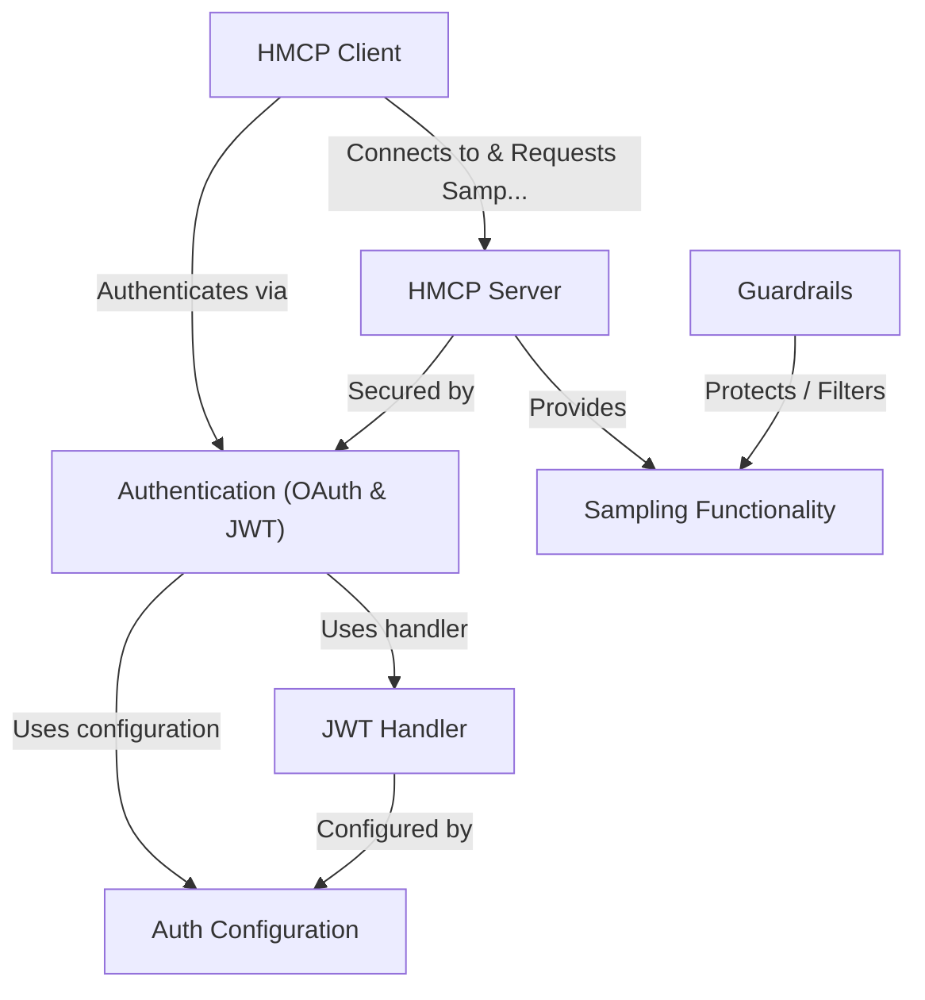

# Tutorial: Healthcare-MCP

This project implements a *secure* server (**HMCP Server**) and corresponding client (**HMCP Client**) for healthcare applications, extending the standard **Model Context Protocol (MCP)**.
Its core new feature is *text generation* (**Sampling Functionality**), allowing the server to create responses based on context.
Access is controlled using **OAuth 2.0 and JWT** for **Authentication**, relying on specific **Auth Configuration** and a **JWT Handler**.
An optional **Guardrails** component provides a safety layer to filter interactions.

**Source Repository:** [https://github.com/amitv-innovaccer/Healthcare-MCP.git](https://github.com/amitv-innovaccer/Healthcare-MCP.git)

## Chapters

1. [HMCP Server
](01_hmcp_server_.md)
2. [HMCP Client
](02_hmcp_client_.md)
3. [Authentication (OAuth & JWT)
](03_authentication__oauth___jwt__.md)
4. [Sampling Functionality
](04_sampling_functionality_.md)
5. [Guardrails
](05_guardrails_.md)
6. [Auth Configuration
](06_auth_configuration_.md)
7. [JWT Handler
](07_jwt_handler_.md)

